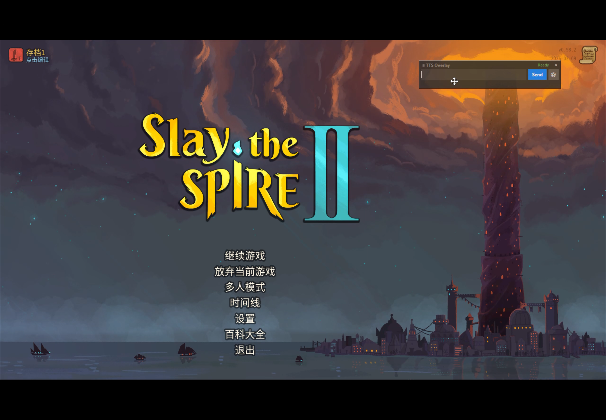

# Floating TTS Overlay for GPT-SoVITS
**一个专为 Windows 无边框游戏设计的极简、轻量、无延迟 GPT-SoVITS 前端悬浮窗。**

[](https://opensource.org/licenses/MIT)

## 🌟 简介 (Introduction)

本扩展工具允许你在进行全屏无边框（Borderless Windowed）游戏或观看全屏直播时，**直接呼出并置顶一个透明的输入框**。
只需输入想说的话，它会自动调用后端的 [GPT-SoVITS](https://github.com/RVC-Boss/GPT-SoVITS) API 接口生成语音，并**在内存中毫秒级直接播放**（不生成中间缓存文件）。

### ✨ 特色功能
- 🪟 **无边框吸附置顶**：原生 Windows 样式消除边框，不挡游戏画面，可随意拖拽挪动位置。
- ⚙️ **图形化配置 UI（支持动态换模）**：告别黑框和修改配置文件！自带精美设置面板（小齿轮图标），自动扫描你 `GPT-SoVITS` 和 `SoVITS` 路径下的权重，**一键即可切换音色模型**，填入参考音频的提示词和语种即可极速合成。
- ⚡ **零存取无延迟**：直接利用 Windows `winsound.SND_MEMORY` 在底层内存中解码和播放音频流。这使得生成的语音能在毫无磁盘 I/O 延迟的情况下迅速传达到你的耳机里。
- 📦 **免环境安装**：利用 Python 纯自带的系统库 `tkinter`, `urllib`, `winsound` 等。只要你能跑得起 GPT-SoVITS 默认的整合包（自带的 `runtime/python` 环境），这套工具双击就能跑，**完全 0 依赖**。

## 📸 界面预览 (Screenshots)


## 🚀 安装与启动 (Installation & Usage)

因为本作依赖原生 GPT-SoVITS 的环境提供推理服务，所以推荐将下载后的 `floating_tts.py` 放在你的 `GPT-SoVITS` 根目录（包含 `api_v2.py` 的那个文件夹内）。

### 第一步：启动核心 API
必须首先启动 GPT-SoVITS 后端原生 API（需用到 v2 的流式无损传输能力）。在你的根目录打开终端运行：
```bat
runtime\python.exe api_v2.py -a 127.0.0.1 -p 9880
```
*提示：切记要用 `runtime\python.exe` 运行，否则可能提示缺少依赖库 `soundfile`。*

### 第二步：启动悬浮窗
无需等待第一步窗口中的模型加载完，你可以直接在另一个新终端窗口（仍是同个根目录）运行：
```bat
runtime\python.exe floating_tts.py
```

### 第三步：配置与使用
首次打开后，请：
1. 点击悬浮窗上的 **⚙ 齿轮图标** 打开 Settings 并置顶。
2. 在下拉框中选择你的 **GPT Model**（.ckpt 权重） 和 **SoVITS Model**（.pth 权重）。
3. 选择你想克隆的参考音频路径（`*.wav`），输入参考音频对应的短语（`Prompt Text`）以及语言。
4. 点击 **Save & Close**（这些配置将会存在根目录下的 `floating_config.json` 中，以后不用重复设置）。

现在，打开你的游戏，尽情游玩并在悬浮框中输入你想要让模型念出的文本吧！按下 `Enter` 或者点击发送即可播报。

## 🛠️ 参数说明与进阶
- **Speed (语速)**：默认 1.0，想让角色说话快一点请设置为 1.2 等。
- **Window Opacity (透明度)**：默认 0.85，调整数值 0-1 以适应不同暗色调的游戏界面（越接近 0 越透明）。
- **Target Lang (目标合成语言)**：支持 `zh`, `en`, `ja`, `auto` (多语种)。

## 🤝 参与贡献 (Contributing)
这是一个非常简单的单文件 Python 小工具！由于是用原生 `tkinter` 写的，它还可以变得更加花哨！欢迎各位提交 PR 改进它的能力（如支持翻译组件、直播弹幕播报联动扩展等）。

## 📄 协议 (License)
使用 [MIT](LICENSE) 协议开源。
你可以自由地在你的项目中修改、分发这个扩展包，仅需保留源声明即可。
